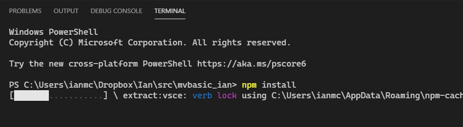
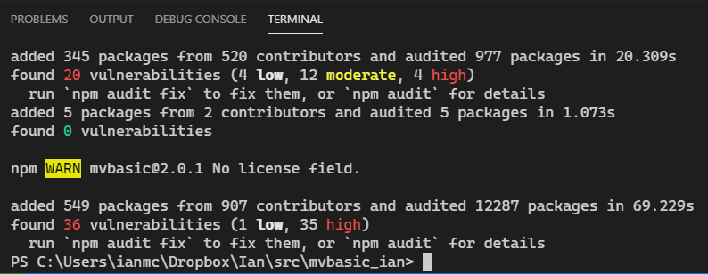
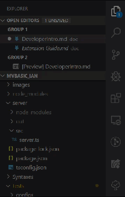
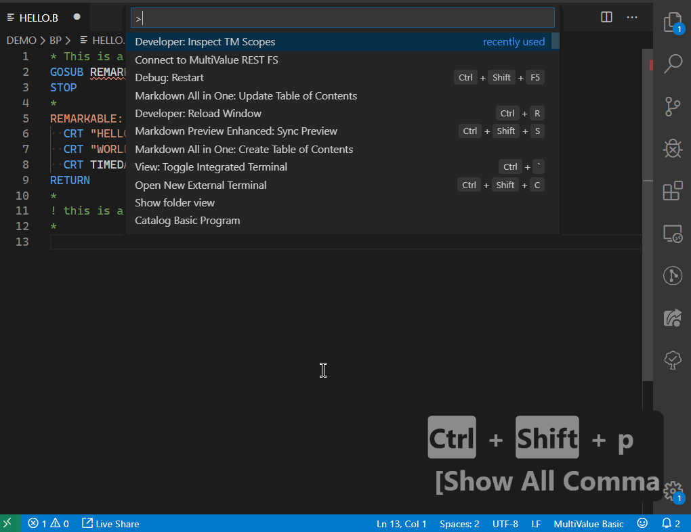
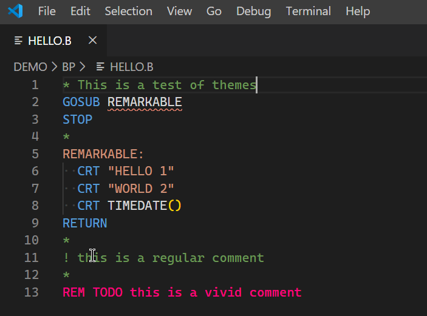
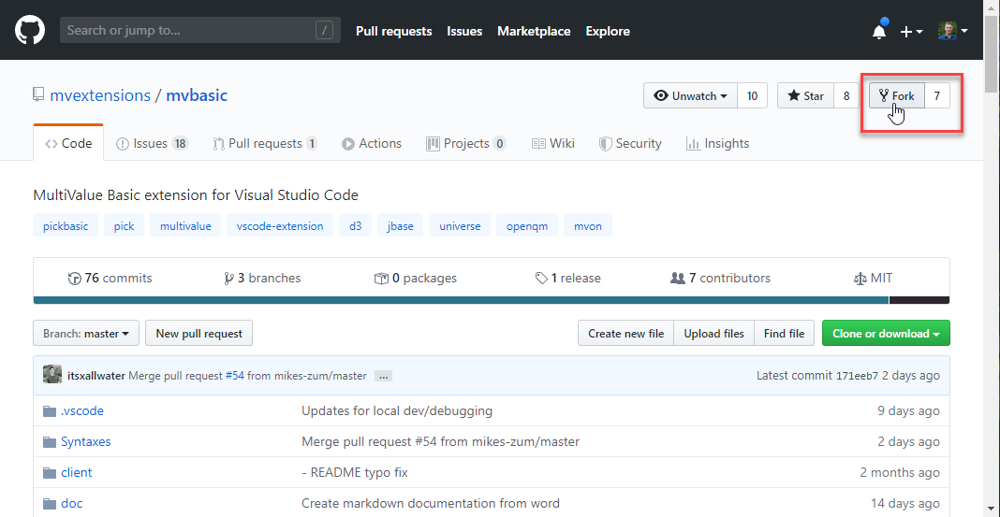
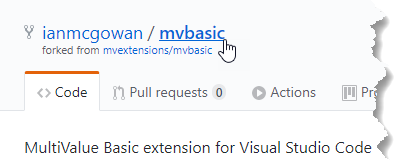

# MVBasic Extension New Developer Guide


# Table of Contents
- [MVBasic Extension New Developer Guide](#mvbasic-extension-new-developer-guide)
- [Table of Contents](#table-of-contents)
- [0. Code of conduct](#0-code-of-conduct)
- [1. Introduction](#1-introduction)
- [2. Installing](#2-installing)
  - [2.1 Install the prerequisites](#21-install-the-prerequisites)
  - [2.2 Option 1 - Clone the repository directly](#22-option-1---clone-the-repository-directly)
  - [2.3 Start the extension and finish development setup](#23-start-the-extension-and-finish-development-setup)
  - [2.4 Running in debug mode](#24-running-in-debug-mode)
- [3. Extension Introduction](#3-extension-introduction)
  - [3.1 Important Configuration Files](#31-important-configuration-files)
    - [3.1.1 Syntax Coloring](#311-syntax-coloring)
    - [3.1.2 Syntax Checking](#312-syntax-checking)
    - [3.1.3 Code Formatting](#313-code-formatting)
    - [3.1.4 Intellisense](#314-intellisense)
    - [3.1.5 Code Snippets](#315-code-snippets)
- [4. Syntax definitions / theming](#4-syntax-definitions--theming)
  - [4.1 Resources](#41-resources)
  - [4.2 Changing/Adding Scopes](#42-changingadding-scopes)
  - [4.3 Overriding theme color choices](#43-overriding-theme-color-choices)
- [5. Formatting](#5-formatting)
- [6. Code validation/Linting](#6-code-validationlinting)
- [7. Building a custom version of the extension](#7-building-a-custom-version-of-the-extension)
- [8. Contributing back / creating a pull request](#8-contributing-back--creating-a-pull-request)
  - [8.1 Option 2 - Fork and Clone the MV Extensions Repo](#81-option-2---fork-and-clone-the-mv-extensions-repo)
    - [8.1.1 Fork the MV Extensions Repo](#811-fork-the-mv-extensions-repo)
    - [8.1.2 Clone the repository from a fork](#812-clone-the-repository-from-a-fork)
    - [8.1.3 Connecting to upstream](#813-connecting-to-upstream)
    - [8.1.4 Create a feature branch](#814-create-a-feature-branch)
    - [8.1.5 Creating a pull request](#815-creating-a-pull-request)

---
# 0. Code of conduct

Important reading for new developers planning on contributing back fixes and enhancements to the extension:

[Code of Conduct](https://github.com/mvextensions/.github/blob/master/CODE_OF_CONDUCT.md)

[Contribution Guidelines](https://github.com/mvextensions/.github/blob/master/CONTRIBUTING.md)

# 1. Introduction

This guide is targeted at an MV Developer who is comfortable with MV Basic and happily using the MV Basic Extension, but would like
to tweak the extension or add new features (and hopefully contribute them back to the project, though that's not a requirement).

The guide will walk through the process of getting the source code for the extension from github, getting everything setup to run in
debug mode, running for the first time, various examples of making minor changes, and finally how to contribute your changes back
with a pull request.

Screenshots of this process will be done from Windows, but everything can be done from Mac/Linux just as easily.  The MV Gateway is
the only part that is not cross-platform, and it's not a hard requirement for using the extension to turbo-charge your MV code
editing.

[(top)](#table-of-contents)
# 2. Installing

## 2.1 Install the prerequisites

Before starting you should have the following installed and working:

* [VSCode](https://code.visualstudio.com/download)
* [Git](https://git-scm.com/downloads)
* [Nodejs](https://nodejs.org/en/download/)

Refer to the individual documentation for detailed instructions, but a basic install is fine.  When the installs are complete you
should be able to successfully run these commands from a shell (versions will be later of course):

```
src>code --version
1.40.2
f359dd69833dd8800b54d458f6d37ab7c78df520
x64

src>git --version
git version 2.14.3.windows.1

src>node --version
v10.16.3
```

## 2.2 Option 1 - Clone the repository directly

This is the simple approach, and less confusing when getting started.  We are going to directly "clone" the mvextensions/mvbasic
repo to our local machine so we have a copy of the source code to work with.

```
c:\>cd src

src>git clone https://github.com/mvextensions/mvbasic.git
```

This will create a new folder, mvbasic, with a complete copy of the repo from github.  This is a fully functional repository.
However, without contributor rights on the remote repo, local changes cannot be pushed back to github.  This is fine for starting
out.

## 2.3 Start the extension and finish development setup

Since we're right there at the prompt, start VSCode and tell it to open the directory we just cloned.

```
src>code mvbasic
```

After VSCode starts up, open a terminal (ctrl+` on windows, or view: toggle integrated terminal from the command palette), and type:

```
npm install
```



The list of ten packages the extension directly depends on is specified in the top-level package.json.  Running "npm ls" from the
command prompt will show the tree of recursive package dependencies.

After churning for a while, downloading, extracting and installing hundrds of packages will complete:



## 2.4 Running in debug mode

From inside the instance of VSCode, hit F5 or from the command palette choose ```Debug: Start Debugging```, or from the side bar click the debug icon, select "Launch Client" and then click "Debug and Run".



This will start a new instance of VSCode running in debug mode, connected back to the controlling instance.  Any changes to the
extension will be made in the controlling instance, and tested in the debug instance.  You will see "building" in the bottom status bar as any changes to the typescript code are transpiled to javascript.

After making a change in the extension code, or altering breakpoints, ctrl+shift+F5 or
Debug: Restart from the command palette to restart the debug instance and make it aware of the changes.

[(top)](#table-of-contents)

# 3. Extension Introduction

## 3.1 Important Configuration Files

There are different areas that control how the extension deals with basic code.  They can be broadly divided into:

* Configuration files that control how the extension interacts with Basic code.
* The client extension in /client/src/extension.ts that runs code inside a VSCode process in response to various VSCode events.
* The server extension in /server/src/server.ts that runs code when called from the client extension.  The server runs in a process outside the main VSCode process.

https://code.visualstudio.com/api/language-extensions/language-server-extension-guide
https://vscode.readthedocs.io/en/latest/extensions/example-language-server/

|Area|Description|File|
|---|---|---|
|Syntax Coloring|Controls how programs are displayed|Syntaxes/mvon.tmLanguage.json|
|Syntax Checking|Linting - this controls the red squiggles and error reports in the status bar|server/src/server.ts<br>validateTextDocument()|
|Code Formatting|Reformats/reindents the program|client/src/extension.ts provideDocumentFormattingEdits()|
|Intellisense|Provides tooltips and code completion|server/src/server.ts|
|User Snippets|User-defined tooltips and code completion|%userprofile%\AppData\Roaming\Code\User\snippets|

### 3.1.1 Syntax Coloring
The highlighting/coloring of code in the editor is controlled by tmLanguage.json files in the syntaxes folder.  This configuration file consists of regular expressions that are run against code as it is edited and assigns each "chunk" of code a scope name.  The themes you select in VSCode will then apply styles to these scopes.  For example, comments are colored in green, labels are blue etc.

### 3.1.2 Syntax Checking
Also known as linting - every time a program is changed the function validateTextDocument in server.ts is called and the entire program is checked for syntax errors.

### 3.1.3 Code Formatting
When Shift+Alt+F or Format Document is called, the current program is reformatted/reindented.

### 3.1.4 Intellisense
Hovering over a statement or function, or pressing Ctrl+Space, will provide a "tooltip" or Intellisense reminder for that function.  The data for these tooltips are loaded dynamically from json files in the Syntaxes folder.

### 3.1.5 Code Snippets
Code snippets are user-defined short-cuts that can be used for any commonly repeated set of keystrokes.  For example, you could type "prog" or "sub", Ctrl+Space, and a standard code header could be inserted, and prompts for the variable parts filled in.  They are not part of the extension, but depending on what you have loaded in snippets, can confuse tooltops and command completion.

[(top)](#table-of-contents)
# 4. Syntax definitions / theming

## 4.1 Resources

An introduction to how syntax highlights work in VSCode: https://code.visualstudio.com/api/language-extensions/syntax-highlight-guide

A description of the various "scopes" typically used: https://macromates.com/manual/en/language_grammars#naming_conventions

Using "Developer: Inspect TM Scopes" to see how a particular token is interpreted.  This will show both the source as well as the scope for any language elements selected.



## 4.2 Changing/Adding Scopes

Let's say we want a particular kind of comment to show up in a hard-to-ignore color.  Theme color choices are applied by matching
the scope rules from the language format selected.  Themes typically target broad scopes like "comment" or "comment.line", but we
can define a more narrow scope by editing mvon.tmLanguage.json, and moving REM to a new scope:

From:
```
{
  "match": "(?i)(^[\\*|!].*|^\\s+[\\*|!].*|^\\s*REM\\s.*|\\;[\\*|!].*|\\;\\s+[\\*|!].*)",
  "name": "comment.line.asterisk.mvon"
},
```

To:
```
{
  "match": "(?i)(^[\\*|!].*|^\\s+[\\*|!].*|\\;[\\*|!].*|\\;\\s+[\\*|!].*)",
  "name": "comment.line.asterisk.mvon"
},

{
  "match": "(?i)(^\\s*REM\\s.*)",
  "name": "comment.line.rem.mvon"
},
```

Which moves the regular expression matching REM at the start of a line into a new scope.

## 4.3 Overriding theme color choices

Now that we've added a new scope, we can target this in our workspace settings:

```
    "editor.tokenColorCustomizations": {
        "textMateRules": [
        {
            "scope":"comment.line.rem.mvon",
            "settings": {
                "foreground": "#FF007F"
            }
        }
    ]
    },
```



[(top)](#table-of-contents)
# 5. Formatting

Formatting is done in javascript code in client/src/extension.ts provideDocumentFormattingEdits.

[(top)](#table-of-contents)
# 6. Code validation/Linting

Code validation is done from javascript code in server/src/server.ts validateTextDocument.

[(top)](#table-of-contents)
# 7. Building a custom version of the extension

[(top)](#table-of-contents)
# 8. Contributing back / creating a pull request

The simple approach of directly cloning the mvextensions/mvbasic repo from github is good to quickly get your hands on the code and
see how the extension is put together.  To make changes and contribute them back to the project with a pull request is more
involved, and requires first forking the repo.

## 8.1 Option 2 - Fork and Clone the MV Extensions Repo

If you are making more than minor edits, it's a good idea to first fork the project repository on Github.  This is an optional step,
and not required unless you plan on submitting changes back to MV Extensions.

Forking will allow two things:

1) You will be able to push any commits made in your local cloned copy of the repo to your fork on github.
2) You will be able to create pull requests in github to allow the mvextensions/mvbasic repo to "pull" those commits into the
   official repo.

### 8.1.1 Fork the MV Extensions Repo

Forking basically means taking a personal copy, while maintaining links to the original project so any future changes can be synced.
At the same time, local changes you make can be pushed to your new fork of the project, since it is yours and yours alone.

To fork the repo from github, click on the fork button to the top right:



After a few seconds of churning, you will be taken to your brand new repo, that is an exact copy of the MV Extensions repo:



### 8.1.2 Clone the repository from a fork

After creating a fork, we clone the repo from that fork, rather than directly from mvextentions/mvbasic.

```
src>git clone https://github.com/ianmcgowan/mvbasic.git mvbasic_ian
```

This will create a new folder, mvbasic_ian, with a complete copy of the forked repo from github, and origin pointing to
ianmcgowan/mvbasic.

### 8.1.3 Connecting to upstream

The names for all these versions are arbitrary, but in the standard github workflow the repo on your PC is named local, the forked
copy you can push changes to is named origin, and the original mvextensions/mvbasic repo is named upstream.  Git is a decentralized
version control system, so none of these are "the" repo, they are all full copies with all the history up to the point they were
forked.  A picture from stackoverflow may be worth a thousand words:


https://stackoverflow.com/questions/9257533/what-is-the-difference-between-origin-and-upstream-on-github/9257901#9257901

https://help.github.com/en/github/getting-started-with-github/fork-a-repo has instructions on how to add "upstream" as a target so
you can keep your local copy in sync with any changes made in the MV Extensions repo.

```
# Show the current remote repos we are connected to
git remote -v
# Add a new remote named "upstream"
git remote add upstream https://github.com/mvextensions/mvbasic.git
# Check the status of our current tree - simpler if we are in sync with origin/master
git status
# Fetch the latest changes from upstream
git fetch upstream
# Merge upstream to get back in sync with mvextensions/mvbasic
git merge upstream/master
# Push the changes to our forked copy (origin/master)
git push origin/master
```

### 8.1.4 Create a feature branch

To make things even more complicated, we can create a branch inside our local repo for whatever "feature" we plan on working on.
For example, I am working in a branch named "devdocs", and have another branch "rembugfix" for researching a bug related to comment
(remark) formatting.  This is very optional, and only comes into play when you are interested in contributing a change back to
mvextensions.  Having separate feature branches makes creating a manageable pull request easier.

### 8.1.5 Creating a pull request