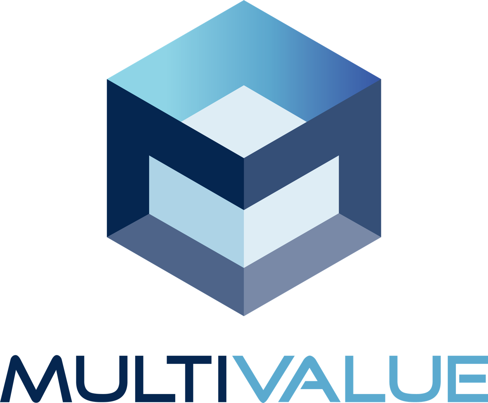
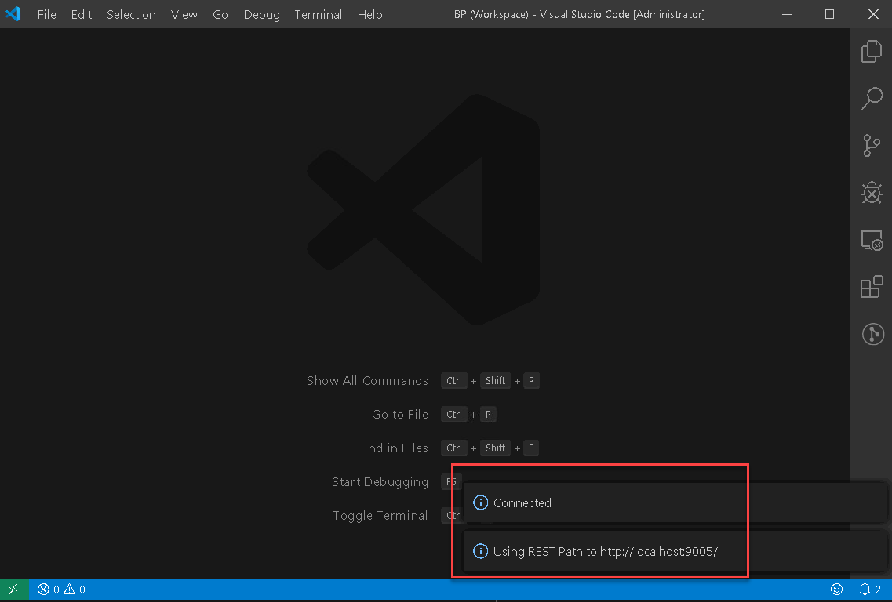
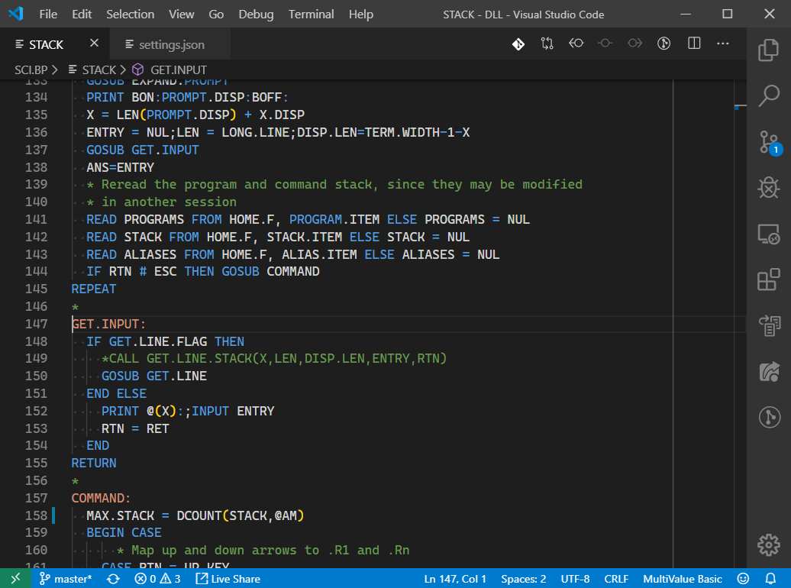
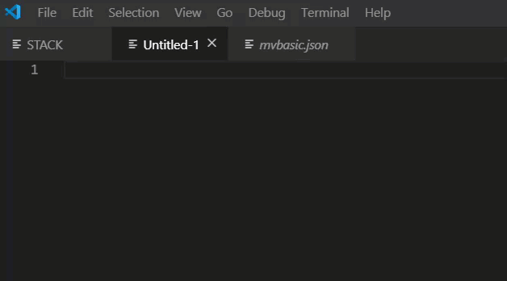

# Visual Studio Code MultiValue Extension



[Licence](../License.txt) Copyright (c) 2019 MVExtensions Group

MIT License
Permission is hereby granted, free of charge, to any person obtaining a copy of this software and associated documentation files (the "Software"), to deal in the Software without restriction, including without limitation the rights to use, copy, modify, merge, publish, distribute, sublicense, and/or sell copies of the Software, and to permit persons to whom the Software is furnished to do so, subject to the following conditions:

The above copyright notice and this permission notice shall be included in all copies or substantial portions of the Software.

THE SOFTWARE IS PROVIDED "AS IS", WITHOUT WARRANTY OF ANY KIND, EXPRESS OR IMPLIED, INCLUDING BUT NOT LIMITED TO THE WARRANTIES OF MERCHANTABILITY, FITNESS FOR A PARTICULAR PURPOSE AND NONINFRINGEMENT. IN NO EVENT SHALL THE AUTHORS OR COPYRIGHT HOLDERS BE LIABLE FOR ANY CLAIM, DAMAGES OR OTHER LIABILITY, WHETHER IN AN ACTION OF CONTRACT, TORT OR OTHERWISE, ARISING FROM, OUT OF OR IN CONNECTION WITH THE SOFTWARE OR THE USE OR OTHER DEALINGS IN THE SOFTWARE.

All other trademarks and service marks are property of their respective holders.

## Table of Contents

- [Visual Studio Code MultiValue Extension](#visual-studio-code-multivalue-extension)
  - [Table of Contents](#table-of-contents)
  - [Purpose of this guide](#purpose-of-this-guide)
  - [1. Introduction](#1-introduction)
  - [2. Prerequisites](#2-prerequisites)
  - [3. Installing VS Code](#3-installing-vs-code)
  - [4. Installing MV Basic Extension](#4-installing-mv-basic-extension)
  - [5. Connecting to a MultiValue Server](#5-connecting-to-a-multivalue-server)
    - [5.1 Option 1 - MVGateway](#51-option-1---mvgateway)
      - [5.1.1 Install the MVGateway](#511-install-the-mvgateway)
      - [5.1.2 Configure the MVGateway](#512-configure-the-mvgateway)
      - [5.1.3 Testing the connection](#513-testing-the-connection)
      - [5.1.4 Troubleshooting the Connection](#514-troubleshooting-the-connection)
    - [5.2 Option 2 - AccuTerm](#52-option-2---accuterm)
      - [5.2.1 Install the Host Programs](#521-install-the-host-programs)
      - [5.2.2 Usage](#522-usage)
      - [5.2.3 Configuration](#523-configuration)
  - [6. MV Developer Features](#6-mv-developer-features)
    - [6.1 Syntax](#61-syntax)
    - [6.2 Intellisense](#62-intellisense)
    - [6.3 Find All References](#63-find-all-references)
    - [6.4 Goto/Peek Definition](#64-gotopeek-definition)
    - [6.5 Internal Subroutine lookup](#65-internal-subroutine-lookup)
    - [6.6 Compiling and Cataloging your programs](#66-compiling-and-cataloging-your-programs)
    - [6.7 Formatting Programs](#67-formatting-programs)
  - [7. Sample Settings Files](#7-sample-settings-files)
    - [7.1 Universe](#71-universe)
    - [7.2 Unidata](#72-unidata)
    - [7.3 OpenQM](#73-openqm)
    - [7.4 jBASE](#74-jbase)
    - [7.5 D3](#75-d3)
    - [7.6 mvBase](#76-mvbase)
    - [7.7 MVON&#35;](#77-mvon)
    - [7.8 Associating Programs with the MVextension](#78-associating-programs-with-the-mvextension)
    - [7.9 Additional MV Basic Developer Settings](#79-additional-mv-basic-developer-settings)
  - [8. Recommended reading/extensions](#8-recommended-readingextensions)
    - [8.0 VS Code Tips and Tricks](#80-vs-code-tips-and-tricks)
    - [8.1 SFTP](#81-sftp)
    - [8.2 Insert Cursor at Beginning of Line](#82-insert-cursor-at-beginning-of-line)
    - [8.3 Cursor Align](#83-cursor-align)
    - [8.4 Cursor Trim](#84-cursor-trim)
    - [8.5 Bracket Pair Colorizer 2](#85-bracket-pair-colorizer-2)
    - [8.6 GitLens](#86-gitlens)

## Purpose of this guide

This document describes how to install and use the MultiValue Basic Visual Studio Code extension in a MultiValue Development Environment. For purposes of this guide:

- MV refers to Pick-style MultiValue application and database environments
- VS Code refers to Microsoft Visual Studio Code
- MV Basic refers to the MV VS Code Extension

[(top)](#table-of-contents)

## 1. Introduction

VS Code is a free, open source, feature rich, IDE that allows programmers to develop and debug code in various languages. There is also a community of developers that have developed extensions that provide functionality for VS Code that isn't built into the main program.

The MV Basic extension provides developers to gain the features of VS Code with MV BASIC programs. This extension provides connectivity to your MultiValue database, reading and writing code and is currently available for jBASE, OpenQM, MVON#, D3, Universe and Unidata. If the source code files are stored in O/S directories that are accessible by the user's system, then it can access other variants of MultiValue database.

Details on how to connect to the different databases are explained in later chapters.

This extension includes the following features:

- Code highlighting for MV Basic Programs
- Intellisense for the MV Basic Statements and Functions
- Code folding
- Code formatting
- Go to/Peek Definition. Automatically jump to and peek internal subroutines
- Go to/Peek Definition. Automatically peek/load `CALL`, `CHAIN` and `INCLUDE` routines
- Syntax checking for `GOTO`, `GOSUB`, `LOOPS`, `CASE` statements and `IF` `THEN`/`ELSE` `END` statements
- Access your remote MV files and programs
- Find all References of a word in current program

VS Code is available on Windows, Linux and Mac OSX.

[(top)](#table-of-contents)

## 2. Prerequisites

The following environment is required in order to use the extension.

1. Windows, Linux or Mac OSX machine.
2. VS Code
3. MVGateway installed (optional, Windows only for remote editing)
4. AccuTerm installed (optional, Windows only for remote editing and alternative to MVGateway)

[(top)](#table-of-contents)

## 3. Installing VS Code

VS Code can be downloaded from the following link:
[https://code.visualstudio.com/download](https://code.visualstudio.com/download)

Select the version for your operating system. If you are running Windows, run either the 32 bit or the 64 bit installer. To check if you are 32 or 64-bit go to control panel/system or in Windows 10 search settings for 32.

[(top)](#table-of-contents)

## 4. Installing MV Basic Extension

Before we can start using the MV features for VS Code, we need to install the MV Basic extension. VS Code has an automated download and installation process for extensions.

Start VS Code and select the Extensions Button. In the search box, type "mvbasic".

Select the MV Developer Extension by clicking on the item in the list then choose install. Once the extension is installed we are ready to start using VS Code on your MV source code.


[(top)](#table-of-contents)

## 5. Connecting to a MultiValue Server

The extension allows users to connect to MV servers and edit, compile and catalog BASIC programs. It currently supports two connection options: MVGateway or [AccuTerm](https://www.zumasys.com/downloads/) (version 7.1+ with an add-on or version 8.0.1020+).

While not required, it is recommended that you alter your VS Code User settings to specify the following:

```json
"files.autoSave": false,
"files.hotExit": false
```

Disabling `autoSave` will reduce the communication traffic back to the server. Disabling `hotExit` will force VS Code to prompt you to save any unsaved changes before exiting.

### 5.1 Option 1 - MVGateway

#### 5.1.1 Install the MVGateway

In order for VS Code to communicate to your MV server install the MVGateway provided with the extension. The MVGateway runs as a Windows service and is installed using the Windows setup program provided. This setup program is included in `%userprofile%\.vscode\extension`. There will be a directory specific to the MV Basic extension. The name of this directory will change slightly with each new release of the extension because it contains the version number of the extension. In that directory is a MVGateway directory with the Windows MSI executable (setup program). Double-click on the MSI file and install the MVGateway service. The gateway does not need any special configuration or setup. The gateway can be installed on any Windows system in your network that has access to your computer and your MV server. Many users install it on their local system if they are running a Windows system.

#### 5.1.2 Configure the MVGateway

Once you have installed the MVGateway the next step is to configure a VS Code Workspace. The workspace will contain all the parameters required to connect and login to the remote MV Server. It is recommended that you use a directory on your system where you will save the workspace definitions. If you have multiple servers and/or multiple accounts on each server, you will create a workspace that points to a each particular server and account. In order to do that we first need to configure a workspace.

To connect to an MV Server, the following information is required:

1. Hostname or IP Address of the MV server.
2. User name to login into the server
3. Password for the user above
4. Account name to connect to on the MV Server

To create a new Workspace:

1. Select `Save Workspace As` from the `File` Menu. In this example, a folder called VS Code is used to store the Workspace definitions. As shown in the above screenshot, a blank Workspace called Demo is created that can now be configured to point to your MV server.
2. To configure the connection parameters open the Workspace settings. One way to do that is to use the menu and select `File` -> `Preference` -> `Setting`.
3. This will bring up the Settings pane in VS Code. Once this is open you MUST select the **Workspace Tab**. This is one area that VS Code has changed so your screen may appear a little different than these screenshots. For many users it is easier to edit the JSON version of the configuration rather than searching for each individual parameter. This is done by clicking on the Open Settings (JSON) button near the top right corner of your VS Code. You can then paste in the appropriate settings for the platform from section:

- [7.1 Universe](#71-universe)
- [7.2 Unidata](#72-unidata)
- [7.3 OpenQM](#73-openqm)
- [7.4 jBASE](#74-jbase)
- [7.5 D3](#75-d3)
- [7.6 mvBase](#76-mvbase)
- [7.7 MVON](#77-mvon)


After adding all the parameters to the workspace, your settings should look similar to this:

```json
{
  "folders": [
    {
      "uri": "RestFS:/",
      "name": "Account - DEMO"
    }
  ],
  "settings": {
    "MVBasic.RestPath": "http://localhost:9005/",
    "MVBasic.GatewayType": "Universe",
    "MVBasic.UseGateway": true,
    "MVBasic.RemoteHost": "192.168.1.2",
    "MVBasic.UserName": "myUserName",
    "MVBasic.Password": "mvPassword",
    "MVBasic.Account": "DEMO"
  }
}
```

These are the base settings required to connect to an Universe MV Server. Press <kbd>Ctl</kbd>+<kbd>S</kbd> to save your settings.

#### 5.1.3 Testing the connection

We can test to if the connection to MV server works by pressing <kbd>F1</kbd> or <kbd>Cmd</kbd>/<kbd>Ctrl</kbd>+<kbd>Shift</kbd>+<kbd>P</kbd>. VS Code will prompt you for the command to run. Type `Connect` to display all commands containing the word "Connect" and choose `Connect to Multivalue REST FS`.

The extension will connect to the server and retrieve a list of Directory files from the server. If the connection is successful, the following messages will appear at the bottom left of the screen.



#### 5.1.4 Troubleshooting the Connection

See [section 7](#7-sample-config-files) for sample configuration files for each MV platform.

To turn on logging in the MV Gateway, add the following to the settings section of the config file and the MVGateway service should log to c:\temp.

```json
"MVBasic.gatewayDebug": true,
"MVBasic.trace.server": "verbose"
```

To test the RestFS connection manually, install a [REST client](https://marketplace.visualstudio.com/items?itemName=humao.rest-client) and review some request/response pairs to make sure the MVGateway service is connecting.


Sample REST requests, these will obviously have to be changed with specific values:

```text
POST http://localhost:9005/login
Content-Type: application/json

{
   "ServerType": "Unidata",
   "UserId": "dsiroot",
   "Password": "password",
   "AccountName": "DEMO",
   "AccountPath": "/unidata/ud61/demo"
}
```

```text
GET http://localhost:9005/dir/DEMO
Content-Type: application/json
```

### 5.2 Option 2 - AccuTerm

To use AccuTerm to connect the MV Basic extension to your MV server, you must be running AccuTerm 7.1 or above (with [this add-on](https://zdownload.blob.core.windows.net/accuterm/Miscellaneous/Windows/x86/1.0.5.0/accuterm-vscode-connector.exe)) or AccuTerm [8.0.1020](https://zdownload.blob.core.windows.net/accuterm/Standard/Windows/x86/8.0.1020.0/atwin_8.0.1020.exe) or above (no add-on required).

The latest version of the AccuTerm host programs should be used with this connector (8.0.7). You can verify your version by typing FTABOUT at a command prompt (TCL) in the ACCUTERM account. You can download version 8.0.7 with [this link](https://zdownload.blob.core.windows.net/accuterm/Host-Programs/Windows/x86/8.0.7.0/pickbp.exe).

*Note: the 8.0.1020 release of AccuTerm 8 **does not** include the latest host programs. You should update the host programs after installing 8.0.1020. See above.*


#### 5.2.1 Install the Host Programs

After installing AccuTerm (or the add-on or host program update), update the host programs in the ACCUTERM account on your MV host via `MultiValue` -> `Host Programs` -> `Update`.

#### 5.2.2 Usage

A new `VSCODE` command is included in AccuTerm is and used to initialize the connection. Use this command just like the existing WED and GED commands:

`VSCODE filename item1 item2 ...`

By launching VS Code with this command, all of the VS Code Workspace configuration is taken care of automatically.

*Note: when using the `VSCODE` command with AccuTerm 8, the "server mode" will automatically terminate when you close VS Code. With AccuTerm 7, you must cancel "server mode" manually.*

#### 5.2.3 Configuration

The default configuration for the `VSCODE` command is usable in most environments, however there are some settings that can be customized. When using the `VSCODE` command to launch VS Code, a temporary workspace is constructed from a template workspace in the ACCUTERMCTRL file. This template is installed the first time you use the `VSCODE` command. You can edit this template if needed to customize certain behaviors. The default template is shown here.

*Note: several settings will be moved to a separate configuration item in a future AccuTerm release, reducing the need to modify the workspace template. Special tokens enclosed in < > are substituted when the `VSCODE` command is invoked and normally should not be modified.*

```json
// AccuTerm VSCode Workspace Template
//
// To change the maximum number of items to list from any file,
// change RestFS.MaxItems. To show items in a dictionary level
// file, change RestFS.SelAttr to 208.
{
  "folders":[{"uri":"RestFS:/","name":"<ACCOUNT>"}],
  "extensions":{"recommendations":["mvextensions.mvbasic"]},
  "settings":{
    "files.associations":{"*":"mvbasic"},
    "files.exclude":{
      "**/.git": true,
      "**/.vscode": true,
      "**/node_modules": true,
      "**/pom.xml": true},
    "files.eol":"\n",
    "MVBasic.ServerName":"<SESSIONID>",
    "MVBasic.Account":"<ACCOUNT>",
    "MVBasic.RestPath":"http://localhost:3181/mvsvr/restfs",
    "MVBasic.UseRestFS":true,
    "MVBasic.languageType":"<DIALECT>",
    "MVBasic.RestFS.AutoConnect":true,
    "MVBasic.RestFS.RestAPI":1,
    "MVBasic.RestFS.MaxItems":250,
    "MVBasic.RestFS.SelAttr":32976,
    "MVBasic.RestFS.CaseSensitive":<CASE>,
    "MVBasic.EditFiles":[
<ITEMS>
    ]
    }
  }
}

```
As noted in the comments above, you can change the maximum number of items that AccuTerm should return to VS Code for populating the file explorer. Also, the attributes used to select files (shown as directories in the explorer) and items (shown as files in the explorer) can be adjusted. The `SelAttr` property is a bit mask, which is the sum of any of the following values.

| attribute       | value |
| --------------- | ----- |
| Read only       | 1     |
| Hidden          | 2     |
| System          | 4     |
| Folder          | 16    |
| Q-pointer       | 64    |
| Normal item     | 128   |
| Data items only | 32768 |

Common selection attributes are 32976 (folder, q-pointer, normal items, data only), 208 (folder, q-pointer, normal items), 215 (everything).

*Note: if you see an exclamation mark next to your MV account name in the VS Code file explorer, with the hover message "unable to resolve workspace folder", it is probably because your MD / VOC or contains more files than `MaxItems`.*


[(top)](#table-of-contents)

## 6. MV Developer Features

The following is a list of features that the extensions offer MV Developers when using VS Code.

### 6.1 Syntax

Code is highlighted based on the current theme selected for VS Code.



### 6.2 Intellisense

As you type your program, you will be prompted with available statements and functions including the syntax and description.



As of version 2.0.4 the extension includes a setting called `MVBasic.languageType` which can be set to `MVON` (default), `jBASE`, `UniVerse` or `OpenQM`. Changing this setting will cause the language server to load the corresponding language definition file and adjust the responses for IntelliSense. Note that syntax highlighting and other code matching are not yet dynamically linked to this selection but that update will be forthcoming.

### 6.3 Find All References

You can find all references to a word in your program by **right clicking** on a word and selecting `Find All References` from the menu.

The display consists of two panels, the right containing the line that the word is in and the actual code block is in the left. Clicking on a line in the right panel will take you to the code block.


### 6.4 Goto/Peek Definition

If you **right click** on a internal or external subroutine name and select `Peek Definition` , a window appears showing the internal or external subroutine.

If you select `Go to Definition`, the cursor is moved to start of the subroutine.


### 6.5 Internal Subroutine lookup

Pressing <kbd>Ctl</kbd>+<kbd>Space</kbd> after the words `GOTO`, `GOSUB` or `GO TO`, will allow you to select from defined internal subroutines in your program.

### 6.6 Compiling and Cataloging your programs

**Right clicking** inside the code window allows you to select 3 options:

1. `Catalog Basic Program` – catalogs the BASIC program
2. `Compile Basic Program` – compiles the basic program.
3. `Compile Basic Program with Debug` – compiles with the debug flag set.

After the option is selected, results are displayed in the `MV Basic` Output window, and errors have clickable links to the source.

### 6.7 Formatting Programs

**Right clicking** and selecting `Format Document`, will format your BASIC program. The formatting is based on the 2 settings, `MVBasic.indent` and `MVBasic.margin` that have default values of 3 and 5.

[(top)](#table-of-contents)

## 7. Sample Settings Files

### 7.1 Universe

```json
{
  "folders": [
    {
      "uri": "RestFS:/",
      "name": "Account - Universe"
    }
  ],
  "settings": {
    "MVBasic.RestPath": "http://localhost:9005/",
    "MVBasic.UseGateway": true,
    "MVBasic.GatewayType": "Universe",
    "MVBasic.RemoteHost": "192.168.1.2",
    "MVBasic.UserName": "myUserName",
    "MVBasic.Password": "myPassword",
    "MVBasic.Account": "DEMO"
  }
}
```

| Setting             | Value                                           | Description                                                                                                |
| ------------------- | ----------------------------------------------- | ---------------------------------------------------------------------------------------------------------- |
| MVBasic.RestPath    | [http://localhost:9005](http://localhost:9005)/ | Path to REST Gateway                                                                                       |
| MVBasic.UseGateway  | true                                            | Indicate that the gateway must be used.                                                                    |
| MVBasic.RemoteHost  | 192.168.1.2                                     | The servers IP/Host name that is running the Universe Database.                                            |
| MVBasic.GatewayType | Universe                                        | Connecting to a Universe server                                                                            |
| MVBasic.UserName    | myUserName                                      | The Windows/UNIX user id to log into the server.                                                           |
| MVBasic.Password    | myPassword                                      | The password for the user above.                                                                           |
| MVBasic.Account     | DEMO                                            | The account name on Universe to connect to. This must be defined in the UV.ACCOUNT file in the UV account. |

### 7.2 Unidata

```json
{
  "folders": [
    {
      "uri": "RestFS:/",
      "name": "Account – Unidata"
    }
  ],
  "settings": {
    "MVBasic.RestPath": "http://localhost:9005/",
    "MVBasic.UseGateway": true,
    "MVBasic.GatewayType": "Unidata",
    "MVBasic.RemoteHost": "192.168.1.2",
    "MVBasic.UserName": "myUserName",
    "MVBasic.Password": "MyPassword",
    "MVBasic.Account": "DEMO",
    "MVBasic.AccountPath": "/usr/data/DEMO"
  }
}
```

| Setting             | Value                                          | Description                                                    |
| ------------------- | ---------------------------------------------- | -------------------------------------------------------------- |
| MVBasic.RestPath    | [http://localhost:9005](http://localhost:9005) | Path to REST Gateway                                           |
| MVBasic.UseGateway  | true                                           | Indicate that the gateway must be used.                        |
| MVBasic.RemoteHost  | 192.168.1.10                                   | The servers IP/Host name that is running the Unidata Database. |
| MVBasic.GatewayType | Unidata                                        | Connecting to a Unidata server                                 |
| MVBasic.UserName    | MyUserName                                     | The Windows/UNIX user id to log into the server.               |
| MVBasic.Password    | MyPassword                                     | The password for the user above.                               |
| MVBasic.Account     | DEMO                                           | A name for this account.                                       |
| MVBasic.AccountPath | /usr/data/DEMO                                 | The path on the Unidata machine to the Unidata account.        |

### 7.3 OpenQM

```json
{
  "folders": [
    {
      "uri": "RestFS:/",
      "name": "Account - QM"
    }
  ],
  "settings": {
    "MVBasic.RestPath": "http://localhost:9005/",
    "MVBasic.UseGateway": true,
    "MVBasic.GatewayType": "QM",
    "MVBasic.RemoteHost": "192.168.1.2",
    "MVBasic.UserName": "MyUserName",
    "MVBasic.Password": "MyPassword",
    "MVBasic.Account": "DEMO"
  }
}
```

| Setting             | Value                                            | Description                                                                                                      |
| ------------------- | ------------------------------------------------ | ---------------------------------------------------------------------------------------------------------------- |
| MVBasic.RestPath    | [http://localhost:9005/](http://localhost:9005/) | Path to REST Gateway                                                                                             |
| MVBasic.UseGateway  | true                                             | Indicate that the gateway must be used.                                                                          |
| MVBasic.remoteHost  | 192.168.1.2                                      | The servers IP/Host name that is running the OpenQM Database.                                                    |
| MVBasic.gatewayType | QM                                               | Connecting to a OpenQM server                                                                                    |
| MVBasic.UserName    | MyUserName                                       | The Windows/UNIX user id to log into the server.                                                                 |
| MVBasic.Password    | MyPassword                                       | The password for the user above.                                                                                 |
| MVBasic.Account     | DEMO                                             | The account name on the QM server to connect to. This must be defined in the ACCOUNTS file in the QMSYS account. |

### 7.4 jBASE

```json
{
  "folders": [
    {
      "uri": "RestFS:/",
      "name": "Account - jBASE"
    }
  ],
  "settings": {
    "MVBasic.RestPath": "http://localhost:9005/",
    "MVBasic.UseGateway": true,
    "MVBasic.GatewayType": "jBASE",
    "MVBasic.RemoteHost": "192.168.1.2",
    "MVBasic.UserName": "MyUserName",
    "MVBasic.Password": "MyPassword",
    "MVBasic.Account": ""
  }
}
```

| Setting             | Value                                            | Description                                                             |
| ------------------- | ------------------------------------------------ | ----------------------------------------------------------------------- |
| MVBasic.RestPath    | [http://localhost:9005/](http://localhost:9005/) | Path to REST Gateway                                                    |
| MVBasic.UseGateway  | true                                             | Indicates that the gateway must be used.                                |
| MVBasic.RemoteHost  | 192.168.137.2                                    | The servers IP name that is running the jBASE Database.                 |
| MVBasic.GatewayType | jBASE                                            | Connecting to a jBASE server                                            |
| MVBasic.UserName    | MyUserName                                       | The Windows/UNIX user id to log into the server.                        |
| MVBasic.Password    | MyPassword                                       | The password for the user above.                                        |
| MVBasic.Account     |                                                  | This is blank, jBASE uses the default path of the user for the account. |

A record in the `MD` called `MVONFILES` can used as a list of available files, alternatively all files are displayed.

### 7.5 D3

```json
{
  "folders": [
    {
      "uri": "RestFS:/",
      "name": "Account – D3"
    }
  ],
  "settings": {
    "MVBasic.RestPath": "http://localhost:9005/",
    "MVBasic.UseGateway": true,
    "MVBasic.GatewayType": "D3",
    "MVBasic.RemoteHost": "192.168.1.2",
    "MVBasic.UserName": "dm",
    "MVBasic.AccountPassword": "",
    "MVBasic.Account": "dm"
  }
}
```

| Setting                 | Value                                            | Description                                                       |
| ----------------------- | ------------------------------------------------ | ----------------------------------------------------------------- |
| MVBasic.RestPath        | [http://localhost:9005/](http://localhost:9005/) | Path to the REST Gateway                                          |
| MVBasic.UseGateway      | true                                             | Indicates that the gateway must be used.                          |
| MVBasic.RemoteHost      | 192.168.137.102                                  | The servers IP name that is running the D3 Database.              |
| MVBasic.GatewayType     | D3                                               | Connecting to a D3 server                                         |
| MVBasic.UserName        | dm                                               | The D3 User name to log in with                                   |
| MVBasic.AccountPassword |                                                  | Specify the account password if a password is set on the account. |
| MVBasic.Account         | dm                                               | The D3 account to connect to.                                     |

MSVP must be configured for the above account and the user must have MSVP access. A record in the `MD` called `VSCodeFILES` can be used as a list of available files, alternatively all files are displayed.

### 7.6 mvBase

```json
{
  "folders": [
    {
      "uri": "RestFS:/",
      "name": "Account – mvBase"
    }
  ],
  "settings": {
    "MVBasic.RestPath": "http://localhost:9005/",
    "MVBasic.UseGateway": true,
    "MVBasic.GatewayType": "mvBase",
    "MVBasic.RemoteHost": "192.168.1.2",
    "MVBasic.UserName": "MyUserName ",
    "MVBasic.AccountPassword": "MyPassword"
  }
}
```

| Setting                 | Value                                            | Description                                                       |
| ----------------------- | ------------------------------------------------ | ----------------------------------------------------------------- |
| MVBasic.RestPath        | [http://localhost:9005/](http://localhost:9005/) | Path to the REST Gateway                                          |
| MVBasic.UseGateway      | true                                             | Indicates that the gateway must be used.                          |
| MVBasic.RemoteHost      | 192.168.137.2                                    | The servers IP name that is running mvBase.                       |
| MVBasic.GatewayType     | mvBase                                           | Connecting to a mvBase server                                     |
| MVBasic.UserName        | MyUserName                                       | The User name to log in with                                      |
| MVBasic.AccountPassword | MyPassword                                       | Specify the account password if a password is set on the account. |

MSVP must be configured for the above account and the user must have MSVP access. A record in the `MD` called `VSCodeFILES` can be used as a list of available files, alternatively all files are displayed.

### 7.7 MVON&#35;

```json
{
    "folders":[
        {
            "uri": "RestFS:/",
            "name": "Account – MVON#",
        }
    ],
    "settings": {
        "MVBasic.RestPath": "http://192.168.1.2/mvonrest",
        "MVBasic.UseGateway": false,
        "MVBasic.UserName": "MyUserName ",
        "MVBasic.Password": "MyPassword",
        "MVBasic.Account: "Netbasic",
        "MVBasic.RemoteDebug": true
    }
}
```

| Setting             | Value                                                      | Description                                                                                      |
| ------------------- | ---------------------------------------------------------- | ------------------------------------------------------------------------------------------------ |
| MVBasic.RestPath    | [http://192.168.1.2/mvonrest](http://192.168.1.2/mvonrest) | URL of the MVON# REST service                                                                    |
| MVBasic.UseGateway  | false                                                      | Indicates that the gateway is not required and may be omitted from the configuration.            |
| MVBasic.UserName    | MyUserName                                                 | The User name to log in with                                                                     |
| MVBasic.Password    | MyPassword                                                 | Specify the account password if a password is set on the account.                                |
| MVBasic.Account     | Netbasic                                                   | Name of the MVON# account you are connecting to.                                                 |
| MVBasic.RemoteDebug | True                                                       | This enables the MVON# remote debugging feature allowing a rich debugging environment in VS Code |

MVON# connects differently from other MV servers. It does not require the MVGateway service, providing a direct connection through the MVON# REST server. You must have this server configured before connecting.

### 7.8 Associating Programs with the MVextension

Most programming languages have a file extension that says what language it is. Python is .py, C# is .cs etc. MV Basic typically does not follow this concept. To manually load the MV Basic extension, choose `Change Language Mode` from the command palette. Choose `MV Basic` from the dropdown and the extension will load. <kbd>Ctrl</kbd>+<kbd>K</kbd>+<kbd>M</kbd>+<kbd>MV</kbd> is a quick keyboard shortcut to achieve that.

To automatically load the extension, we can configure the workspace so any files without a known extension are linked to the MV BASIC extension. This is achieved by adding the following setting to your Workspace settings.

```json
{
  "folders": [
    {
      "uri": "RestFS:/",
      "name": "Account - DEMO"
    }
  ],
  "settings": {
    // Other settings,
    "files.associations": {
      "*.html": "html",
      "*.js": "javascript",
      "*.json": "json",
      "*.md": "markdown",
      "*.py": "python",
      "*.txt": "text",
      "*": "mvbasic"
    }
  }
}
```

In some cases the suggestions made by the extension can be an annoyance. To keep the suggestions, but only get auto-completion when tab is pressed, set:

```json
"editor.acceptSuggestionOnEnter": "off"
```

### 7.9 Additional MV Basic Developer Settings

The following settings are available to customize your VS Code MV Basic Developer experience.

| Setting                   | Description                                                            |
| ------------------------- | ---------------------------------------------------------------------- |
| MVBasic.margin            | The number of characters to use as a margin when formatting.           |
| MVBasic.indent            | The number of characters to use when indenting code blocks.            |
| MVBasic.useCamelCase      | Use CamelCase for Intellisense keywords.                               |
| MVBasic.ignoreGotoScope   | The linter will not highlight goto that jump into the middle of loops. |
| MVBasic.formattingEnabled | Set to true to enable automatic code formatting on filesave.           |

## 8. Recommended reading/extensions

### 8.0 VS Code Tips and Tricks

[VS Code's Tips and Tricks](https://code.visualstudio.com/docs/getstarted/tips-and-tricks) is worth reading and trying out commands from the various sections to get an idea of what is possible in VS Code.

Additionally, this [Medium article](https://medium.com/@nafiszaman/multiple-cursors-visual-studio-code-a2e2f531c5b5) is a good introduction to "Multiple Cursors" - one of the most useful features in VS Code.


### 8.1 SFTP

If working with a Linux/Unix system, this extension allows a workflow where opening a local file automatically downloads/syncs from a remote server, and saving automatically uploads the changed file back to the server. Multiple profile support (for things like dev/uat/prod) is also helpful.

```json
"uploadOnSave": true
"downloadOnOpen": true
```

[VS Marketplace Link](https://marketplace.visualstudio.com/items?itemName=liximomo.sftp)

### 8.2 Insert Cursor at Beginning of Line

Multiple cursors are one of the indispensible features of VS Code. You can create multiple cursors by <kbd>Alt</kbd>-clicking, using <kbd>Ctrl</kbd>+<kbd>D</kbd> to select one-by-one, or highlighting a block and <kbd>Ctrl</kbd>+<kbd>Alt</kbd>+<kbd>I</kbd>. This inserts a cursor at the end of the selected lines by default. This extension changes the behavior to insert the cursor at the start of the lines, which makes using cursor align easier.

[VS Marketplace Link](https://marketplace.visualstudio.com/items?itemName=kaiwood.insert-cursor-at-beginning-of-each-line-selected)

### 8.3 Cursor Align

Aligns using spaces. If you like to line things up in your code, this extension makes doing so less of a chore.

Cursor Align


Selection Align


[VS Marketplace Link](https://marketplace.visualstudio.com/items?itemName=yo1dog.cursor-align)

### 8.4 Cursor Trim

This extension provides a quick way to delete white-space.


[VS Marketplace Link](https://marketplace.visualstudio.com/items?itemName=yo1dog.cursor-trim)

### 8.5 Bracket Pair Colorizer 2

A customizable extension for colorizing matching brackets, making it easier to scan visually.


[VS Marketplace Link](https://marketplace.visualstudio.com/items?itemName=CoenraadS.bracket-pair-colorizer-2)

### 8.6 GitLens

GitLens adds various enhancements to the git experience from within VS Code. If there are multiple developers using git for source control it provides at a glance code authorship:


For single developers, tools like "current line history" showing the change history for the current line are very convenient:


[VS Marketplace Link](https://marketplace.visualstudio.com/items?itemName=eamodio.gitlens)

[(top)](#table-of-contents)
